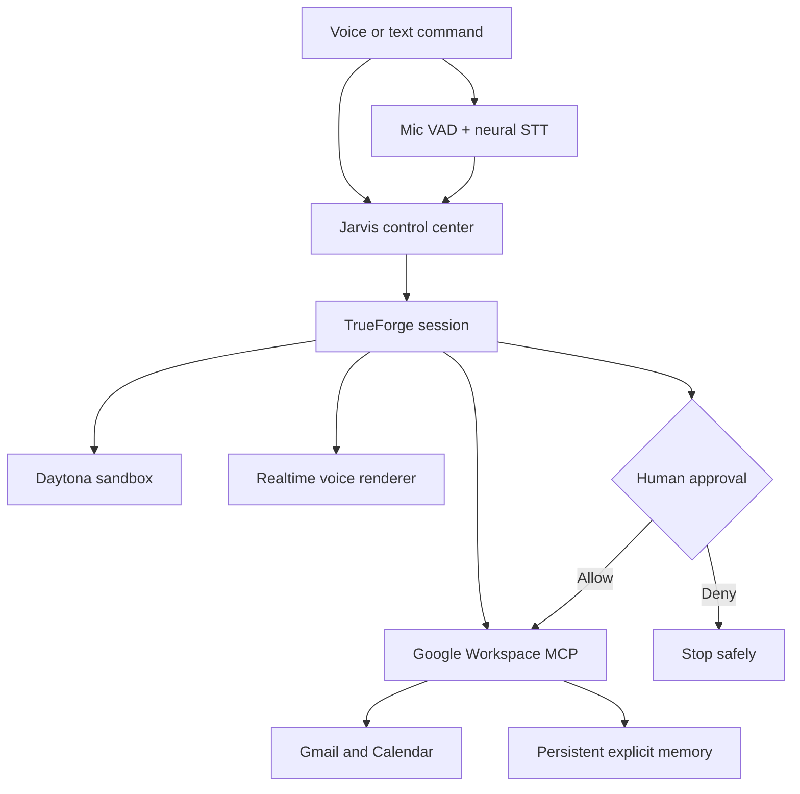

# Jarvis // Personal Operations

> A voice-enabled personal operations agent that investigates Gmail and Calendar, calculates a safe plan in an isolated sandbox, remembers explicit user preferences, speaks naturally while it works, and pauses for human approval before sending or rescheduling anything.

Built for **The Agent Harness Hackathon 2026** on [TrueForge](https://github.com/truefoundry/trueforge).

## Why this is an agent—not a chatbot

“I’m running one hour late. Check what this affects and handle it.”

Jarvis turns that one instruction into observable work:

1. Voice input records until Jarvis detects that the user has stopped speaking, then neural STT produces the command.
2. TrueForge opens a persistent session and recalls relevant explicit memories when useful.
3. Inbox and calendar subagents investigate in parallel.
4. Real Gmail and Google Calendar data arrives through our MCP server.
5. Code Mode uses a Daytona sandbox to normalize time zones and calculate conflicts.
6. Natural-language TrueForge output is spoken through a persistent OpenAI Realtime WebRTC voice channel while tools continue running. A short client playout buffer gives the next speech request time to render and removes transport silence between queued messages.
7. Jarvis prepares the exact email and calendar mutation.
8. TrueForge pauses on `tool.approval_required`.
9. The control center shows the arguments and lets the user allow or deny them.
10. Only an approved call reaches Google; the session retains the audit trail.



## TrueForge is central

This project uses TrueForge for the execution loop rather than wrapping a model response:

- MCP initialization and real tool routing
- Dynamic subagents for parallel inbox/calendar investigation
- Sandbox-as-tool and Code Mode for scheduling calculations
- Approval checkpoints on `send_email` and `move_calendar_event`
- Streaming events shown as an execution trace
- Persistent sessions and reconnect-safe audit history
- Token and cost metrics from completed turns

The custom UI consumes TrueForge’s TypeScript SDK through a small server-side streaming bridge. Approval decisions are returned as `user.tool_approval` events; the UI cannot bypass the harness gate.

The Realtime model is intentionally **not** a second agent. It receives no Google tools, memory tools or decision authority. It is a voice-rendering channel for natural-language text already produced by TrueForge. If Realtime is unavailable, Jarvis falls back to the neural TTS endpoint and finally browser speech synthesis.

## Voice interaction

Jarvis uses three progressively degraded voice layers:

- **Preferred output:** a persistent WebRTC connection using `gpt-realtime-1.5` with the `marin` voice, ordered lookahead playout and brisk conversational pacing.
- **Output fallback:** `gpt-4o-mini-tts` with one ordered clip prefetched while the current clip plays, then browser speech synthesis.
- **Input:** browser recording with adaptive client-side voice activity detection, followed by `gpt-4o-mini-transcribe`. After actual speech begins, roughly 900 ms of sustained silence ends the recording automatically. The mic button remains a manual stop fallback.

Voice output follows TrueForge response text as it streams. Raw tool arguments, execution trace diagnostics and sandbox output are never narrated.

## Persistent memory

Jarvis exposes bounded MCP memory tools for explicit user preferences and facts:

- `recall_memories`
- `remember_fact`
- `forget_memory`

Ordinary conversation is not silently persisted. Local memory defaults to `.jarvis/memory.json`, which is excluded from version control.

## Repository layout

```text
apps/
  control-center/       React + Vite command, voice and approval interface
  orchestrator/         TrueForge SDK streaming + server-side audio bridge
  google-workspace-mcp/ Gmail, Calendar and persistent-memory MCP server
scripts/
  setup-trueforge.ts    Idempotent connector and agent registration
docs/
  architecture.md       Trust boundaries and execution flow
  design.md             Interface rationale and accessibility evidence
  demo-script.md        Three-minute judging walkthrough
  submission.md         Short hackathon write-up
```

## Prerequisites

- Node.js 22.14 or newer
- A model API key supported by TrueForge
- An OpenAI API key for neural STT and Realtime/TTS voice
- A [Daytona](https://www.daytona.io/) API key for sandbox execution
- A Google Cloud project with Gmail API and Google Calendar API enabled
- Google OAuth credentials and a refresh token for an account you own

## Google OAuth scopes

Request only these scopes:

```text
https://www.googleapis.com/auth/gmail.readonly
https://www.googleapis.com/auth/gmail.send
https://www.googleapis.com/auth/calendar.events
```

Keep the OAuth app in testing while developing, add your Google account as a test user, and store the refresh token only in `.env`. Never put credentials or personal inbox/calendar data in the repository or demo recording. For a normal personal OAuth token, keep `GOOGLE_USER_EMAIL=me`; a literal different mailbox can trigger delegated-mailbox authorization errors.

## Local setup

```bash
git clone <your-fork-or-repository-url>
cd jarvis-ops-agent
cp .env.example .env
npm install
```

Fill in the OpenAI and Google OAuth variables in `.env`, then start the Google MCP service.

Generate a dedicated bearer token for the private TrueForge-to-MCP connection and place it in `JARVIS_MCP_BEARER_TOKEN`:

```bash
openssl rand -hex 32
```

The setup script stores this token as a redacted TrueForge header credential. The MCP service binds to `127.0.0.1` by default; set `MCP_HOST` explicitly only when deploying it behind authenticated HTTPS.

```bash
npm run dev:mcp
```

In a second terminal, start TrueForge:

```bash
npm run trueforge
```

Open `http://localhost:8790` and configure:

1. **Settings → Models** — connect the provider matching `TRUEFORGE_MODEL`.
2. **Settings → Sandbox providers** — configure Daytona.

Register the Jarvis MCP connector and agent:

```bash
npm run setup:trueforge
```

Start the API and control center:

```bash
npm run dev:api
npm run dev:ui
```

Open `http://localhost:5173`.

## Safe UI development mode

Set `JARVIS_DEMO_MODE=true` only while working on the interface. It replaces Google data inside the MCP server and displays **DEMO DATA** in the system rail. Do not use demo mode in the hackathon recording—the judged flow must visibly use real tools.

## Verification

```bash
npm run check
npm run build
```

The test suite covers approval-call reconstruction, MCP error propagation, root/subagent stream isolation, mail-header injection protection, URL-safe message encoding, visible Gmail failure feedback, streamed speech segmentation, voice-activity endpointing, persistent memory and the user approval interaction.

Automated UI checks also run `axe-core` against the command center and human-approval checkpoint. See [the interface design evidence](docs/design.md) for the interaction model, responsive behavior, accessibility decisions and known limitations.

## Qodo Code Review Evidence

Every substantive feature was reviewed before merge, and each finding was answered in its original thread:

- [PR #1 — authenticated Google Workspace MCP and final integration](https://github.com/sahil1330/jarvis-ops-agent/pull/1)
- [PR #2 — TrueForge streaming runtime and session safety](https://github.com/sahil1330/jarvis-ops-agent/pull/2)
- [PR #3 — voice control center and approval interface](https://github.com/sahil1330/jarvis-ops-agent/pull/3)
- [PR #4 — Best UI accessibility and design evidence](https://github.com/sahil1330/jarvis-ops-agent/pull/4)
- [PR #7 — visible tool failures and in-viewport live outcomes](https://github.com/sahil1330/jarvis-ops-agent/pull/7)
- [PR #8 — neural voice and persistent user memory](https://github.com/sahil1330/jarvis-ops-agent/pull/8)
- [PR #9 — speech during the live agent/tool loop](https://github.com/sahil1330/jarvis-ops-agent/pull/9)

Qodo surfaced 11 valid findings across the original stack, including an unauthenticated write-capable MCP endpoint, unbounded session and response state, concurrent stream hazards, stale UI events and misleading health states. We fixed every finding, added regression coverage, replied with the relevant commit evidence and requested follow-up reviews; the final reviewed heads reported **0 bugs**, with no findings dismissed.

## Safety model

- Read tools are autonomous; write tools are explicitly named in `requireApprovalForTools`.
- MCP annotations also mark write and destructive behavior.
- Every MCP request requires a constant-time-checked bearer credential held by TrueForge.
- The MCP service binds to `127.0.0.1` unless an explicit deployment host is configured.
- The Google refresh token remains in the MCP process, never in the model or sandbox.
- The OpenAI API key remains in the orchestrator; the browser receives only the WebRTC session answer, never the key.
- The Realtime voice channel has no MCP servers or TrueForge authority.
- The sandbox receives no Google or model credentials.
- Email headers are sanitized before constructing RFC 2822 messages.
- Calendar moves reject invalid time ranges.
- A denial is terminal for that tool call; Jarvis is instructed never to work around it.

See [SECURITY.md](SECURITY.md) for reporting and handling guidance.

## AI assistance disclosure

AI coding assistance was used during implementation. The participant reviewed the architecture, code, tests, safety boundaries and technical decisions, and remains responsible for the submitted work. This disclosure is included to comply with the hackathon rules.

## License

[MIT](LICENSE) © 2026 Sahil Mane
